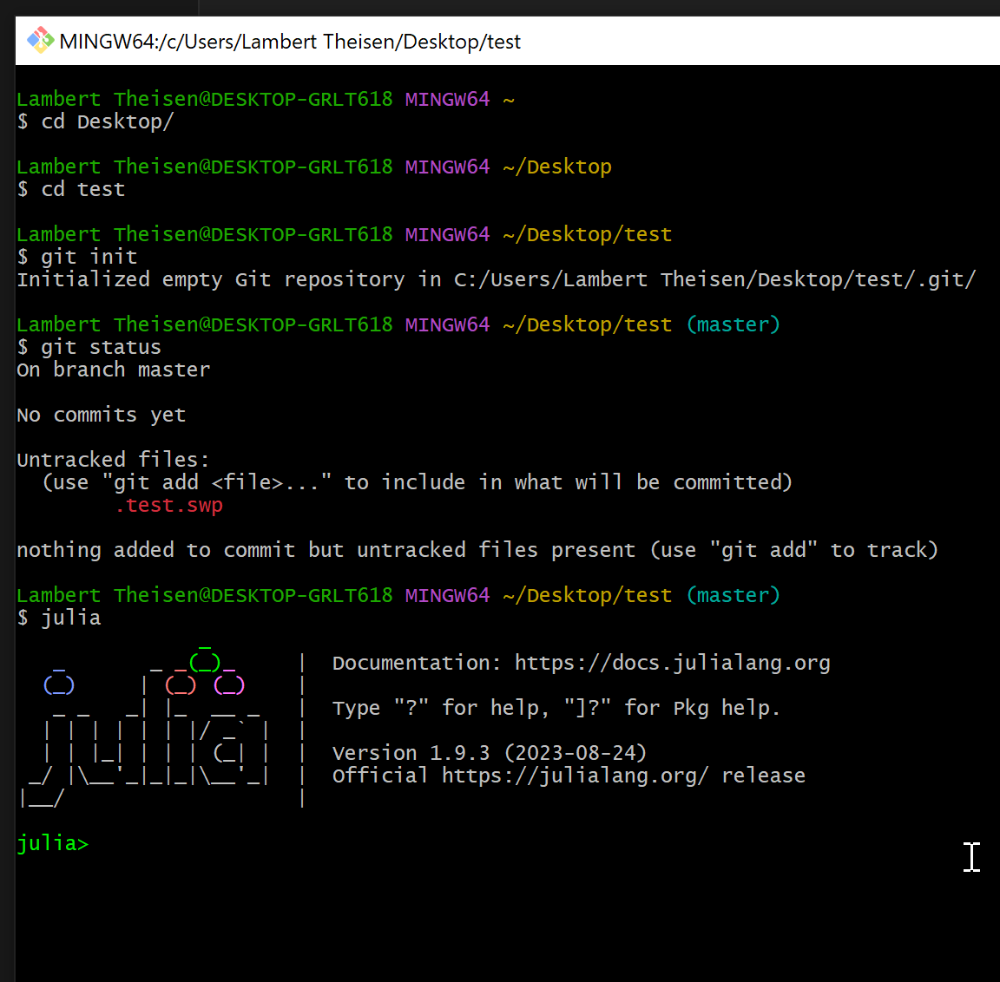
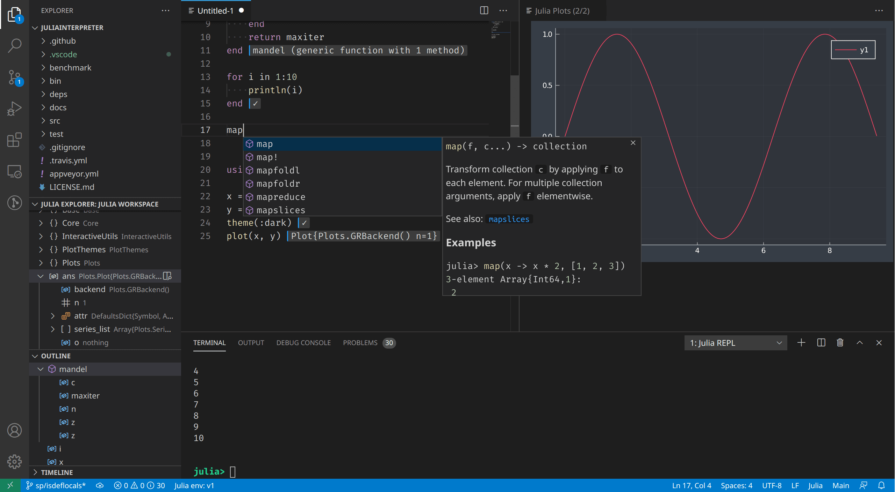

# Basics of Sustainable Software Engineering in Julia

Sustainable Software Engineering is an essential aspect of modern software development, focusing on practices that ensure long-term efficiency, maintainability, and scalability of software projects. This introduction covers the core principles of Sustainable Software Engineering, including the use of Git for version control, the importance of testing, the role of documentation, and the specifics of applying these practices in the Julia programming language.

## Basic Introduction to Linux Shell

### Overview
The Linux Shell is a command-line interface (CLI) used in Linux operating systems. It allows users to interact with the system by typing commands, rather than using a graphical interface.

### Accessing the Shell on UNIX (+maxOS)
- **Terminal:** Open the terminal application from your Linux desktop environment.

### Accessing the Shell on Windows
- **Git Bash:** Has most of the common tools included.
- Other options: PowerShell, WSL, ...


### Basic Commands
1. **`pwd`** - Print Working Directory. Shows the current directory you are in.
2. **`ls`** - Lists files and directories in the current directory.
   - **`ls -l`**: Detailed list.
   - **`ls -a`**: Includes hidden files.
3. **`cd`** - Change Directory.
   - **`cd ..`**: Move one directory up.
   - **`cd /path/to/directory`**: Move to a specific directory.
4. **`mkdir`** - Make a new directory.
5. **`rmdir`** - Remove an empty directory.
6. **`touch`** - Create a new empty file.
7. **`cp`** - Copy files or directories.
   - **`cp source destination`**: Copy source to destination.
8. **`mv`** - Move or rename files or directories.
9. **`rm`** - Remove files or directories.
   - **`rm -r`**: Recursive remove (for directories).
10. **`echo`** - Display a line of text.
11. **`cat`** - Concatenate and display file content.
12. **`grep`** - Search text using patterns.
13. **`man`** - Display the manual of a command.

### System Information
- **`df`**: Report file system disk space usage.
- **`top`**: Display Linux tasks.

### Tips
- Use the **Tab** key for auto-completing commands and file names.
- Use **up and down arrow keys** to navigate through command history.


## Introduction to Markdown

### What is Markdown?
Markdown is a lightweight markup language that you can use to add formatting elements to plaintext text documents. Created by John Gruber in 2004, Markdown is now one of the world's most popular markup languages.

### Why Use Markdown?
- **Simplicity**: Markdown is easy to learn and use.
- **Portability**: Markdown files are plain text, so they're readable on any device.
- **Flexibility**: You can convert Markdown to HTML, PDF, and more.

### Basic Syntax

#### Headings
Use `#` for headings. More `#`s mean smaller headings.

```markdown
# Heading 1
## Heading 2
#### Heading 3
```

#### Emphasis
- *Italic*: Use `*` or `_` around the text.
- **Bold**: Use `**` or `__` around the text.

```markdown
*Italic text*
**Bold text**
```

#### Lists
For unordered lists, use `*`, `+`, or `-`. For ordered lists, simply number them.

```markdown
- Item 1
- Item 2
  - Sub Item 1
  - Sub Item 2
```

#### Links and Images
- Links: `[Text](URL)`
- Images: ``

```markdown
[Google](https://www.google.com)

```

#### Code
- Inline code: Use backticks ` `` `, `Inline code`
- Code blocks: Use triple backticks with optional language identifier
```julia
1+1
# 2
```

#### Blockquotes
Use `>` for block quotes.

```markdown
> This is a blockquote.
```


## Integrated Development Environment (IDE)
- **VS Code**: All-in-one solution, quite good for Julia programming
- Other choices: Vim, Emacs, Atom, Jetbrains, ...



Source: VSCode docu

## Further Reading/References

- CLick PDF slides in https://thsn.dev/blog/publishing-reproducable-numerics
- https://aeturrell.github.io/coding-for-economists/wrkflow-version-control.html
- https://merely-useful.tech/py-rse/git-cmdline.html
